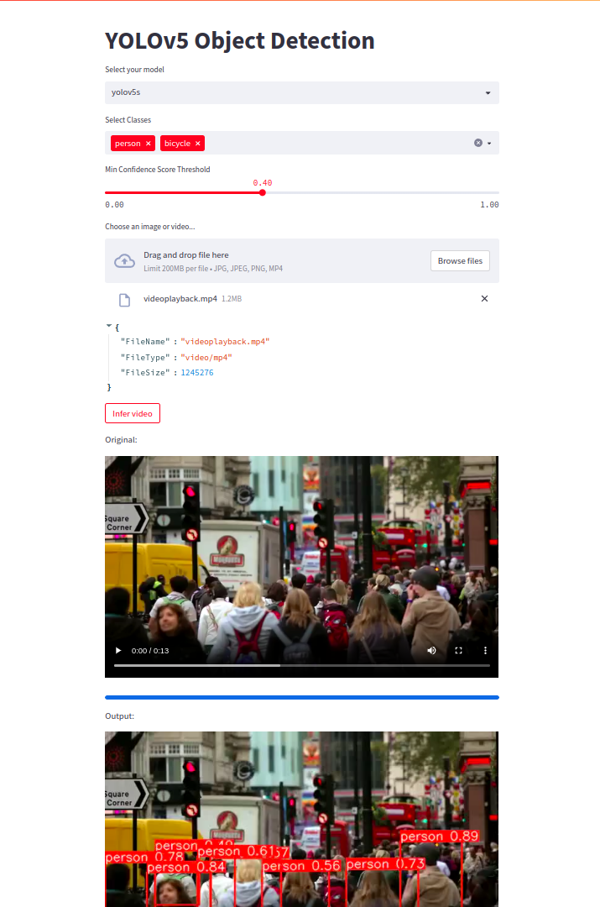

# YOLOv5 Streamlit Object Detection App

This repository contains a Streamlit application for object detection using YOLOv5. The application is capable of processing both image and video inputs. It can easily be deployed in a Docker environment.

## Contents
- [YOLOv5 Streamlit Object Detection App](#yolov5-streamlit-object-detection-app)
  - [Contents](#contents)
  - [Installation](#installation)
  - [Usage](#usage)
  - [License](#license)

## Installation

Ensure Docker is installed on your machine. Clone the repository and navigate to the project directory.

```bash
git clone https://github.com/username/yolov5-streamlit.git
cd yolov5-streamlit
```

The application can be run using Docker Compose:

```bash
docker-compose up
```

The application will then be accessible at `http://localhost:8501`.

## Usage

The application offers an interactive user interface to perform object detection on uploaded images and videos. Once the application is running at `http://localhost:8501`, you will find several interactive options:

1. **Model Selection**: Choose the model for object detection. Currently, only 'yolov5s' is available.
  
2. **Class Selection**: You can select the classes you're interested in detecting. If no class is selected, all classes will be considered during detection.

3. **Confidence Threshold**: A slider is available to set the minimum confidence score threshold for the object detection. You can adjust this threshold as per your requirements, with higher values being more restrictive.

4. **File Upload**: You can upload either an image (jpg, jpeg, png) or video (mp4) file. Once uploaded, the file details will be displayed. 

For images:
- You can hit the 'Infer' button to start the object detection. 
- The detected objects will be displayed alongside the original image.

For videos:
- The application will first convert the uploaded video to MP4 format using FFMPEG.
- After conversion, you can hit the 'Infer video' button to start object detection. 
- The application will process each frame of the video and perform object detection. 
- Both the original and the processed videos will be displayed in the application.

Remember that processing videos, especially long ones, may take a while due to the frame-by-frame object detection.



## License

This project is licensed under the terms of the MIT license.